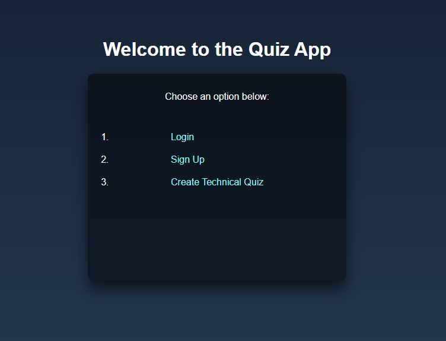

# QuizTech

QuizTech is a powerful quiz application built using Flask, Python, and MySQL. This repository contains the source code and necessary files to create an interactive and feature-rich quiz platform. The application enables users to register, log in, select quiz categories, attempt quizzes, and view their results.

## Features

- **User Authentication**: The application includes user registration and login functionality to ensure secure access to the quiz platform.
- **Quiz Categories**: Users can choose from various quiz categories, providing a personalized quiz experience.
- **Dynamic Quiz Generation**: The application fetches questions and options from the MySQL database based on the selected quiz category, creating dynamic and engaging quizzes for each user.
- **Quiz Attempt and Scoring**: Users can attempt quizzes by selecting options for each question. The application calculates and displays the user's score and percentage based on the selected options.
- **User Responses**: The application stores user responses in the MySQL database, enabling future analysis and tracking of user performance.

## How to use this Project

1. Download the files using the `git clone` command:
$git@github.com:Astha2401/QuizTech.git

2. Create a virtual environment. A virtual environment helps to keep project dependencies separate:
$ python3 -m venv env
$ source env/bin/activate

3. Install the project dependencies from the `requirements.txt` file:
$ pip install -r requirements.txt

4. Run the `quiz.py` file:
$ python quiz.py

Open your browser and enter http://localhost:5000 to view the project live.
Press CTRL-C to stop the server.

To deactivate the virtual environment, use the following command:
$ deactivate

## File Structure

The repository is organized as follows:

- `main.py`: Contains the main application code and handles routing and logic.
- `templates/`: Directory containing HTML templates for the different application views.
- `static/`: Directory containing static files such as CSS stylesheets and JavaScript files.

## Dependencies

The QuizTech application has the following dependencies:

- Flask: A lightweight web framework for Python.
- MySQL Connector: A Python library for connecting and interacting with MySQL databases.

These dependencies are listed in the `requirements.txt` file and can be installed using `pip`.

## Contributing

Contributions to QuizTech are welcome! If you encounter any bugs or want to add new features, feel free to create issues or submit pull requests. Please ensure you follow the repository's code style and guidelines.

## License

This project is licensed under the [MIT License](LICENSE). You are free to use, modify, and distribute the code in any way you see fit.

## Acknowledgements

The QuizTech application was developed by [ASTHA] as a demonstration of Flask, Python, and MySQL integration for building robust quiz platforms. It was inspired by the desire to create a user-friendly and technically advanced quiz application.
   
